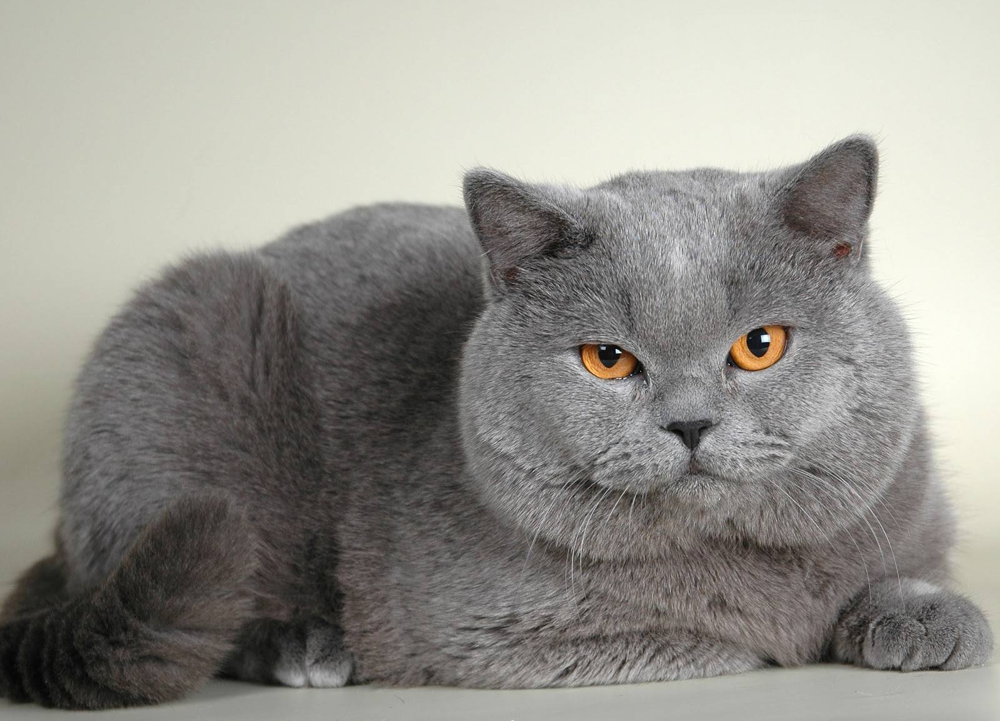

# mcv_l3_2023
# Лабораторная работа №3
## Модель alexnet

## Теоритическая база

AlexNet (CIFAR-10) - это сверточная нейронная сеть, разработанная Алексом Крижевским, Ильей Суцкевером и Джеффри Хинтоном в 2012 году. Она состоит из 8 слоев: 5 сверточных слоев, 2 полносвязных слоя и 1 слой softmax. Сеть была разработана для классификации изображений из набора данных CIFAR-10, который состоит из 10 классов, в один из них. AlexNet считается первой глубокой обучаемой моделью, достигшей значительного успеха в конкурсе ImageNet Large Scale Visual Recognition Challenge (ILSVRC), выиграв конкурс в 2012 году с частотой ошибок топ-5, равной 16,4%. Это также была первая CNN, которая сделала это, проложив путь к широкому распространению CNN в задачах компьютерного зрения.

TensorRT — высокооптимизированная библиотека для глубокого обучения, которая предоставляет быстрые инференсные решения для моделей глубокого обучения. Она была разработана компанией NVIDIA и используется для ускорения инференса глубоких нейронных сетей на графических процессорах (GPU). Библиотека поддерживает широкий спектр архитектур GPU, включая Volta, Turing иAmpere, и позволяет разработчикам ускорить инференс до 7 раз по сравнению с библиотеками CPU. TensorRT также предоставляет API для оптимизации модели, что позволяет исследователям и разработчикам оптимизировать модели для достижения максимальной производительности.


## Описание разработанной системы

Алгоритм работы системы
1. Загрузка названий классов изображений.
2. Открытие изображения и преобразование его в тензор.
3. Запуск обработки на обычной модели.
    1. Загрузка модели.
    2. Запуск модели на тензоре.
    3. Преобразование результатов.
    4. Вывод результатов.
4. Запуск обработки на модели TensorRT.
    1. Загрузка модели.
    2. Запуск модели на тензоре.
    3. Преобразование результатов.
    4. Вывод результатов.

## Результаты работы и тестирования системы

Для работы системы использовалась машина со следующими характеристиками
  + CPU: Intel i5-11300H
  + GPU: RTX 3060 Laptop
  + RAM: 40 GB
  + OS: Linux Mint 21.1

Логи вывода системы

```
Regular model

Load time regular model 0.4885752201080322
Load time regular model 0.48568296432495117
Load time regular model 0.47722339630126953
Load time regular model 0.4794943332672119
Load time regular model 0.4797966480255127
Mean load time 0.48215451240539553

Time to predict: 0.10043501853942871
Time to predict: 0.000986337661743164
Time to predict: 0.0005655288696289062
Time to predict: 0.0004897117614746094
Time to predict: 0.0005049705505371094
Mean predict time 0.0205963134765625

6 most probable classes for cat.jpeg:
Persian cat: 42.398%
Egyptian cat: 24.365%
lynx, catamount: 8.438%
tiger cat: 7.881%
cougar, puma, catamount, mountain lion, painter, panther, Felis concolor: 4.494%
Arctic fox, white fox, Alopex lagopus: 4.411%
Peak of used memory 283280

TensorRT model

Load time TRT model 1.7372806072235107
Load time TRT model 1.732086181640625
Load time TRT model 1.7299432754516602
Load time TRT model 1.7235231399536133
Load time TRT model 1.7114837169647217
Mean load time 1.7268633842468262

Time to predict: 0.08315706253051758
6 most probable classes for cat.jpeg:
Persian cat: 42.308%
Egyptian cat: 24.408%
lynx, catamount: 8.445%
tiger cat: 7.905%
cougar, puma, catamount, mountain lion, painter, panther, Felis concolor: 4.497%
Arctic fox, white fox, Alopex lagopus: 4.407%

Time to predict: 0.0003197193145751953
6 most probable classes for cat.jpeg:
Persian cat: 42.308%
Egyptian cat: 24.408%
lynx, catamount: 8.445%
tiger cat: 7.905%
cougar, puma, catamount, mountain lion, painter, panther, Felis concolor: 4.497%
Arctic fox, white fox, Alopex lagopus: 4.407%

Time to predict: 0.0003566741943359375
6 most probable classes for cat.jpeg:
Persian cat: 42.308%
Egyptian cat: 24.408%
lynx, catamount: 8.445%
tiger cat: 7.905%
cougar, puma, catamount, mountain lion, painter, panther, Felis concolor: 4.497%
Arctic fox, white fox, Alopex lagopus: 4.407%

Time to predict: 0.00020575523376464844
6 most probable classes for cat.jpeg:
Persian cat: 42.308%
Egyptian cat: 24.408%
lynx, catamount: 8.445%
tiger cat: 7.905%
cougar, puma, catamount, mountain lion, painter, panther, Felis concolor: 4.497%
Arctic fox, white fox, Alopex lagopus: 4.407%

Time to predict: 0.00015687942504882812
6 most probable classes for cat.jpeg:
Persian cat: 42.308%
Egyptian cat: 24.408%
lynx, catamount: 8.445%
tiger cat: 7.905%
cougar, puma, catamount, mountain lion, painter, panther, Felis concolor: 4.497%
Arctic fox, white fox, Alopex lagopus: 4.407%

Mean predict time 0.016839218139648438

Peak of used memory 1515522067

```

Исходное изображение




## Выводы по работе

В процессе выполнения данной работы были получено, что при одинаковых входных данных TensorRT одинаково определяет вероятные классы.
При использовании TensorRT увеличивается скорость загрузки модели в память и количество используемой памяти, но уменьшается время обработки изображения.
В системах real-time время обработки важнее всего, поэтому использование TensorRT будет оправдано.
  
## Использованные источники

1. https://github.com/spmallick/learnopencv/blob/master/Image-classification-pre-trained-models/Image_Classification_using_pre_trained_models.ipynb
2. https://pytorch.org/docs/stable/torch.html
3. https://github.com/NVIDIA-AI-IOT/torch2trt
